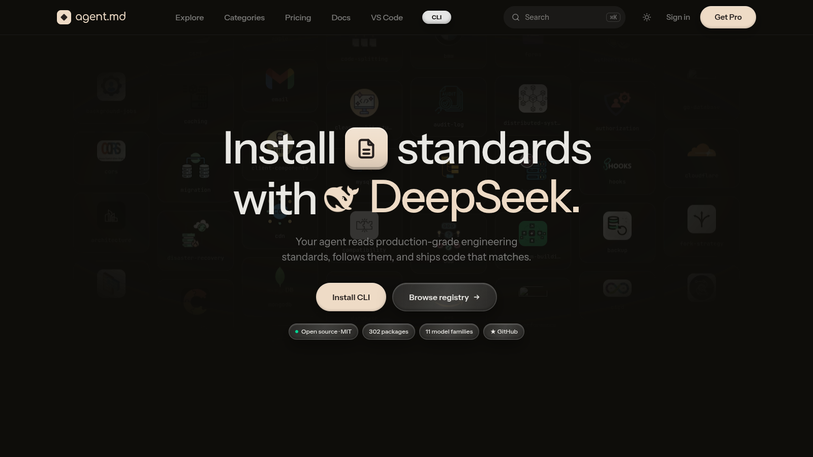
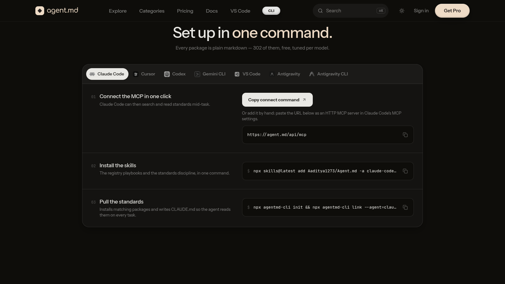
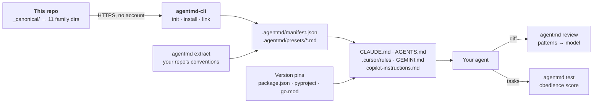

<div align="center">


# Agent.md

### The toolchain that stops AI coding agents from writing broken, deprecated code

Your agent's training data is frozen. Your dependencies are not.<br>
Agent.md gives **Claude Code, Cursor, Codex, Gemini CLI and Copilot** the rules your project actually runs on —<br>
installed like packages, scoped like linters, enforced like tests.

<br>

<a href="https://agent.md"></a>

<br>

[](https://www.npmjs.com/package/agentmd-cli)
[](https://www.npmjs.com/package/agentmd-cli)
[](LICENSE)
[](https://nodejs.org)
[](CONTRIBUTING.md)


```bash
npx agentmd-cli init
```

**302 canonical standards · 20 categories · 11 model families · MIT · no account, no telemetry**

**[Why](#-why-this-exists) · [Quick start](#-quick-start) · [The four pillars](#-the-four-pillars) · [How it works](#%EF%B8%8F-how-it-works) · [Agents](#-supported-agents) · [Registry](#-the-registry) · [Compare](#-compared-with-the-alternatives) · [Contributing](#-contributing) · [FAQ](#-faq)**

</div>

---

## 🔥 Why this exists

Every AI coding agent now reads a rules file. Claude Code reads `CLAUDE.md`. Codex reads `AGENTS.md`. Cursor reads `.cursor/rules`. Gemini CLI reads `GEMINI.md`. Copilot reads `copilot-instructions.md`.

**The format is standardised. The content is not.** So this happens on every team, in every repo:

```
Week 1   Someone writes CLAUDE.md in a hurry before a demo.
Week 3   It's 400 lines. Nobody has read it since week 1.
Week 8   The stack moved to Pydantic 2. The file didn't. The agent still writes .dict().
Week 12  The agent confidently violates a rule that was in the file the whole time.
Week 16  Someone starts a new repo and writes the same 400 lines again, slightly differently.
```

Three failures hide inside that story, and they are the three things nobody had a tool for:

| The failure | What it costs you | What Agent.md does about it |
| --- | --- | --- |
| **Training cutoff.** The model remembers the API that was current when it was trained. | Half an hour debugging code that calls a method deprecated two years ago | **Version pins** — reads the majors you run and tells the agent which methods are gone, before it writes a line |
| **Context bloat.** A 500-line rules file goes into every prompt, and the model stops reading it. | Tokens burned on rules for files you aren't touching; instruction dilution | **Scoped rules** — one rule per standard, attached only while a matching file is open |
| **No feedback loop.** Rules are wishes. Nothing checks whether the agent obeyed. | Violations reach code review; nobody knows which rules the model ignores | **`review` and `test`** — lint the diff against the rules, and benchmark obedience |

And the fourth, the one every tech lead recognises: the rules that matter most are the *unwritten* ones, repeated in every code review. **`extract`** writes them down from your repo.

---

## 🚀 Quick start

Four commands. Each one is copy-paste and does exactly what it says.

**1. Scan the stack, install matching standards, pin breaking library changes**

```bash
npx agentmd-cli init
```
```
  ✓ Next.js                  package.json (next)
  ✓ PostgreSQL               package.json (pg)
  ⇅ Next.js 16               package.json (next ^16.1.0)   (version pin)
  ⇅ Pydantic 2               pyproject.toml (pydantic>=2.6) (version pin)

Recommended packages for claude:
  Security       authentication, owasp, sql-injection
  Database       postgres, indexes, migration
  ...
Install these? [Y/n]
```

**2. Infer your team's unwritten conventions from git history and configs**

```bash
npx agentmd-cli extract          # add --dry to print without writing
```
```
Gathered evidence from 14 files (96k chars, claude-opus-5)
  ✓ 9 conventions → .agentmd/presets/local-Team-conventions.md
  Run `agentmd link` to wire it in.
```

**3. Lint a diff against your standards — deterministic, offline, zero tokens**

```bash
npx agentmd-cli review --fast --fail-on=high
```
```
Reviewing 1 changed file against 12 standards (patterns only)

  HIGH   src/repo.ts:14  Security/sql-injection › sql-string-interpolation  [pattern]
         SQL built by string interpolation — use a parameterised query.

  1 finding at or above "high" — failing.
```

**4. Measure whether the agent actually obeys the rules**

```bash
npx agentmd-cli test              # needs ANTHROPIC_API_KEY
```
```
Rule efficacy — 3 standards × 3 tasks  (claude-opus-5)

  ✓ Security/jwt            3/3
  ✗ API/pagination          1/3   task 2: ignored "Use cursor pagination" — offset/limit used

Score: 7/9 (78%)
```

Then `npx agentmd-cli link` writes everything into `CLAUDE.md`, `AGENTS.md`, `.cursor/rules`, `GEMINI.md` or `copilot-instructions.md`, and you commit `.agentmd/` so the whole team gets the same rules.

<div align="center">
<a href="https://agent.md#setup"></a>
</div>

---

## 🏛 The four pillars

### ⇅ Breaking-change version pins

`init` reads the majors from `package.json`, `pyproject.toml`, `requirements.txt` and `go.mod`. `link` writes short, hand-written, version-specific rules into the agent file — only the breaking differences models routinely get wrong:

```markdown
### Version pins (detected from this project)

**Pydantic 2** — _pyproject.toml (pydantic>=2.6)_
- Use `.model_dump()` / `.model_dump_json()` / `.model_validate()` — `.dict()`, `.json()`, `.parse_obj()` are deprecated v1 names.
- Validators are `@field_validator` and `@model_validator`; `@validator` and `@root_validator` are deprecated.

**Next.js 16** — _package.json (next ^16.1.0)_
- Request APIs are async only — `params`, `searchParams`, `cookies()`, `headers()` must be awaited.
- `middleware.ts` is `proxy.ts`; the old filename is not picked up.
```

Pins exist for Next.js 13–16, React 18–19, Pydantic 1–2, SQLAlchemy 2, Django 5, Prisma 5–7, Tailwind 3–4, Express 5, Zod 4, ESLint 9, Vue 3, Go 1.22–1.25 and Python 3.12–3.13. Bump a dependency, run `link`, and the agent file follows.

### 🎯 File-glob context scoping

`link` never pastes standards into your prompt — every target gets a short block of *links*, so 30 standards add a few hundred tokens, not thousands. For Cursor it goes further and writes **one scoped `.mdc` rule per standard** with file globs by category:

| Category | Attached while editing |
| --- | --- |
| Database | `*.sql`, `*.prisma`, `prisma/`, `migrations/`, `db/`, `models/` |
| Frontend / Design | `*.tsx`, `*.jsx`, `*.vue`, `*.svelte`, `*.css`, `components/`, `pages/` |
| Backend / API | `api/`, `server/`, `routes/`, `controllers/`, `services/`, `*.py`, `*.go` |
| Testing | `*.test.*`, `*.spec.*`, `tests/`, `conftest.py`, `*_test.go` |
| DevOps | `Dockerfile*`, `docker-compose*`, `.github/workflows/`, `*.tf`, `*.yml` |

The Postgres standard costs nothing while you edit CSS.

### 🧬 Convention extraction

`extract` reads the folder structure, lint/format/type configs, `package.json` scripts, the last 50 commit subjects and a bounded sample of source and tests, then asks Claude for only the conventions with evidence in that sample — each rule cites the file or config it came from. The result is a normal standard (`Team/conventions`) in your manifest: `link` includes it, `update` leaves it alone, `remove` removes it.

### 🛡 Zero-cost enforcement + agent test suites

Every `review` starts with a **deterministic pattern fast-path** — interpolated SQL, `SELECT *`, `eval`/`exec`, shell commands built from variables, MD5/SHA-1 for secrets, `Math.random()` tokens, `jwt.decode` without verify, wildcard CORS, hard-coded secrets, Pydantic v1 calls, sync `cookies()` in Next.js 15+ — scoped to the standards you installed. `--fast` stops there: no key, no network, milliseconds. The full review sends the diff and standards to Claude (prompt-cached) or, with `--local`, to Ollama on your machine. `test` generates adversarial tasks per standard, runs them with the standard in context, and judges every attempt — so you know which rules the model actually follows.

---

## ⚙️ How it works



1. **Content is written once** in `_canonical/<Category>/<name>.md` and generated per model family — XML-tagged sections for Claude, compact imperative bullets for OpenAI, and so on.
2. **The CLI fetches** the family you use straight from this repository over HTTPS, records it in `.agentmd/manifest.json` with a checksum, and keeps the markdown in `.agentmd/presets/`.
3. **`link` writes** a managed block into whichever agent files your tools already read, plus the version pins, plus scoped rules for Cursor. Everything outside the block is yours.
4. **`update` respects your edits** — a package you tuned is skipped unless you pass `--force`; `outdated` tells you what drifted.
5. **`review` and `test` close the loop**: the diff is checked against the rules; the rules are checked against the model.

---

## 🤖 Supported agents

| Target | File written | Read by |
| --- | --- | --- |
| `claude` | `CLAUDE.md` | Claude Code |
| `agents` | `AGENTS.md` | Codex, Amp, Jules, Antigravity and others |
| `cursor` | `.cursor/rules/agentmd.mdc` + one scoped `agentmd-*.mdc` per standard | Cursor |
| `gemini` | `GEMINI.md` | Gemini CLI |
| `copilot` | `.github/copilot-instructions.md` | GitHub Copilot |

**Teach the agent itself.** Two [Agent Skills](https://skills.sh) ship with the toolchain — `agentmd-usage` (the registry playbooks) and `agentmd-standards` (the discipline of following what's installed):

```bash
npx skills@latest add Aaditya1273/Agent.md -a claude-code -a cursor -y
```

**Connect the MCP.** The registry is also an MCP server, so an agent can search and read standards mid-task:

```bash
claude mcp add --transport http agentmd https://agent.md/api/mcp     # Claude Code
codex  mcp add agentmd --url https://agent.md/api/mcp                # Codex
gemini mcp add --transport http agentmd https://agent.md/api/mcp     # Gemini CLI
```

Cursor and VS Code add it in one click from [agent.md](https://agent.md#setup). Claude Code users can also `/plugin marketplace add Aaditya1273/Agent.md` for `/agentmd:setup` and `/agentmd:review`.

---

## 📦 What's in this repo

This repository **is the registry** — the markdown the CLI installs. Nothing else lives here, so it stays easy to read, diff and review.

```
_canonical/<Category>/<preset>.md     the source of truth: one file per standard
claude/<Category>/<preset>/…          that standard, in Claude's native shape
open-ai/<Category>/<preset>/…         …and in OpenAI's, and nine more families
```

| Family | Directory | Family | Directory |
| --- | --- | --- | --- |
| Claude | `claude/` | Kimi | `kimi/` |
| OpenAI | `open-ai/` | GLM | `glm/` |
| Gemini | `gemini/` | MiniMax | `minimax/` |
| DeepSeek | `deepseek/` | Mistral | `mistral/` |
| Grok | `grok/` | Sarvam | `sarvam-ai/` |
| Qwen | `qwen/` | | |

The count that matters is **302**; the 3,322 files are the same standards in each family's native shape. The CLI (`agentmd-cli` on npm), the VS Code extension, the MCP server and the website are the tooling around this content — docs for all of them at **[agent.md](https://agent.md)**.

---

## 📚 The registry

| Category | Examples |
| --- | --- |
| **Security** | owasp, jwt, oauth, sql-injection, xss, csrf, cors, secret-management, passwords, headers |
| **Backend** | express, nextjs, fastapi, django, flask, pydantic, python-async, go-http, go-errors, go-concurrency |
| **Database** | postgres, mysql, mongodb, prisma, sqlalchemy, go-database, indexes, migration, schema-design |
| **Frontend** | react, nextjs, typescript, tailwind, hooks, server-components, routing, forms, state-management |
| **API** | rest, graphql, pagination, versioning, rate-limiting, webhooks, open-api, sdk |
| **Testing** | unit, integration, e2e, pytest, go-testing, load, accessibility, test-strategy |
| **Performance** | caching, go-performance, bundle-size, rendering, queries |
| **DevOps** | docker, kubernetes, github-actions, cicd, deployment, environments, rollback |
| **System Design** | architecture, caching, microservices, event-driven, distributed-systems, high-availability |
| **Design** | 74 brand design languages — apple, stripe, linear, vercel, airbnb, spotify… |
| + AI, Review, Documentation, Checklists, Startup, Business, Open Source, Templates, Community, Research | |

Browse everything with logos and search at **[agent.md](https://agent.md)**, or from the terminal:

```bash
npx agentmd-cli search "rate limiting"
npx agentmd-cli list claude/Security
npx agentmd-cli info Security/jwt
npx agentmd-cli install Security/jwt          # one package
npx agentmd-cli install Database/             # a whole category
```

Every install fetches the file straight from this repository over HTTPS. No mirror, no account, no telemetry.

---

## 🛡 Enforce it in CI

Drop this into `.github/workflows/agentmd-review.yml` in your own repo. Zero token cost, no API key, nothing leaves the runner:

```yaml
name: agentmd review
on: [pull_request]
permissions:
  contents: read
jobs:
  review:
    runs-on: ubuntu-latest
    steps:
      - uses: actions/checkout@v4
        with: { fetch-depth: 0 }
      - uses: actions/setup-node@v4
        with: { node-version: 20 }
      - run: npx agentmd-cli review --base origin/${{ github.base_ref }} --fast --fail-on=high
```

Want a full model review that comments on the PR? Add `ANTHROPIC_API_KEY` to your secrets, give the job `pull-requests: write`, and swap `--fast` for `--github`. Need diffs to stay on your own machines? `agentmd review --local` judges with [Ollama](https://ollama.com) instead.

---

## 🆚 Compared with the alternatives

| | Agent.md | Hand-written `CLAUDE.md` | Awesome-list of prompts | Cursor Rules |
| --- | :--: | :--: | :--: | :--: |
| Curated, reviewed content | ✅ | ❌ | ⚠️ varies | ❌ |
| Install with one command | ✅ | ❌ | ❌ | ❌ |
| Detects your stack | ✅ | ❌ | ❌ | ❌ |
| Pins breaking library versions | ✅ | ❌ | ❌ | ❌ |
| Scopes rules to the files you're editing | ✅ | ❌ | ❌ | ⚠️ manual |
| Learns your own conventions | ✅ `extract` | ✋ by hand | ❌ | ✋ by hand |
| Checks the diff against the rules | ✅ `review` | ❌ | ❌ | ❌ |
| Measures whether the model obeys | ✅ `test` | ❌ | ❌ | ❌ |
| Update path / staleness report | ✅ | ❌ | ❌ | ❌ |
| Works across multiple agents | ✅ 5 | ❌ 1 | ⚠️ copy-paste | ❌ 1 |
| Open source | ✅ MIT | n/a | ⚠️ varies | ❌ |

---

## 🤝 Contributing

Standards are plain markdown, written once in `_canonical/<Category>/<name>.md`:

```markdown
---
name: jwt
category: Security
description: Issuing and validating JSON Web Tokens safely — algorithm pinning, claim validation, key rotation.
license: MIT
author: Agent.md maintainers
last-verified: 2026-09-13
reviewed-by: unreviewed
version: 2.0.0
---

# Purpose
…
# Anti-patterns
…
# Checklist
```

The bar: imperative, specific, opinionated, short right/wrong code blocks, an anti-patterns table and a checklist, ~200 lines. Match a neighbour in the same category. Open a PR with the canonical file; maintainers generate the eleven family variants.

**Most wanted right now:** Rust, Vue, Svelte, NestJS and Java. The CLI already detects those stacks and deliberately recommends nothing, because there is no content for them yet. See [CONTRIBUTING.md](CONTRIBUTING.md).

---

## 🗺 Roadmap

| Status | Item |
| --- | --- |
| ✅ **Shipping** | CLI (`init` · `install` · `link` · `update` · `outdated` · `extract` · `review` · `test`) · version pins · scoped Cursor rules · pattern fast-path · Ollama review · MCP server · Agent Skills · Claude Code plugin · VS Code + Cursor extension · 302 standards for 11 families |
| 🔨 **Next** | Rust / Vue / Svelte / NestJS / Java packs · extension on the Marketplace · Claude Code scoped rules · per-package semantic versions |
| 💭 **Considering** | Signed packages · publishing from outside this repo · first-class private team registries |

---

## ❓ FAQ

**Is this a replacement for `CLAUDE.md` / `AGENTS.md` / Cursor rules?**
No. Those are file formats. Agent.md is the distribution layer that fills them in and keeps them current — `link` writes into whichever ones your tools already read.

**Does it paste 30 standards into my prompt?**
No. `link` writes a short block of *links*; the agent opens a standard when it needs it. For Cursor it also writes one scoped rule per standard with file globs, attached only while a matching file is open.

**What does `review --fast` actually check?**
Deterministic patterns over the added lines of a diff, scoped to the standards you installed. High precision on purpose — a false positive in CI costs more trust than a missed catch. The model-backed review catches the rest.

**Why one file per family instead of one file?**
Models differ in what they follow. Claude responds to XML-tagged sections; OpenAI models to compact imperative bullets. Writing once and generating per family keeps content identical while the shape fits the reader.

**Does anything leave my machine?**
`init`, `install`, `link`, `review --fast` and `review --local` never contact Anthropic. `review`, `extract` and `test` send the diff / evidence and the installed standards to the Anthropic API under your own key — nothing else. The website and the CLI collect no telemetry.

**Is anything paid?**
No. All 302 standards, the CLI, the extension and the MCP server are MIT licensed.

---

## License

[MIT](LICENSE). Use it anywhere, including commercial projects, no attribution required.

<div align="center">

**[agent.md](https://agent.md)** · **[npm](https://www.npmjs.com/package/agentmd-cli)** · **[X @agent_dot_md](https://x.com/agent_dot_md)**

<sub>If Agent.md saved you a debugging session, a ⭐ helps the next person find it.</sub>

</div>
